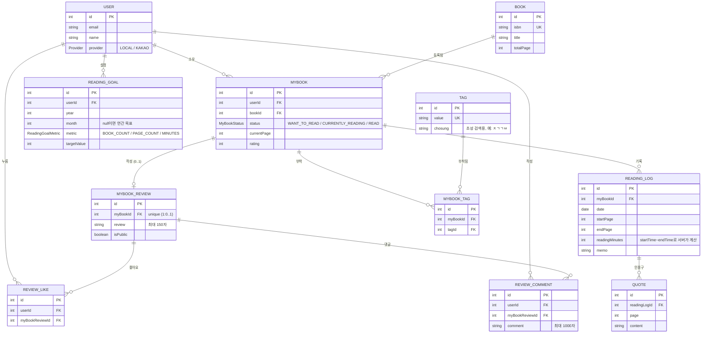

# 📚 book-habit-nest

독서 습관을 기록하고 관리하는 백엔드 API 서버입니다. 카카오/알라딘에서 책 메타데이터를 가져와 내 서재로 등록하고, 독서 세션(기록)을 남기고, 한줄평을 공개해 다른 사용자와 좋아요/댓글로 상호작용하고, 연/월 단위 독서 목표를 관리할 수 있습니다.

[NestJS](https://docs.nestjs.com) + TypeScript + [Prisma](https://www.prisma.io) + MySQL로 구성되어 있습니다.

## 목차

- [주요 기능](#주요-기능)
- [기술 스택](#기술-스택)
- [아키텍처](#아키텍처)
- [도메인 모델](#도메인-모델)
- [시작하기](#시작하기)
- [스크립트](#스크립트)
- [API 문서](#api-문서)
- [프로젝트 구조](#프로젝트-구조)
- [설계 노트](#설계-노트)

## 주요 기능

- **인증**: 이메일/비밀번호 로그인 + 카카오 소셜 로그인, JWT access/refresh 토큰을 httpOnly 쿠키로 발급
- **책 검색/등록**: 카카오·알라딘 오픈 API로 책을 검색하고, ISBN 기준으로 로컬 DB에 정규화하여 저장
- **내 서재(MyBook)**: 읽고 싶어요 → 읽는 중 → 다 읽음 상태 전이, 평점, 진행 페이지 관리
- **독서 기록(ReadingLog)**: 세션별 시작/종료 시간·페이지를 기록하면 읽은 시간이 자동 계산되고, 내 서재의 현재 페이지가 최신 기록 기준으로 자동 동기화됨
- **인용구(Quote)**: 독서 기록에 문장 하이라이트 저장
- **한줄평(MyBookReview)**: 공개/비공개 설정이 가능한 한줄평 + 좋아요/댓글, 공개된 리뷰는 비로그인 사용자도 피드로 열람 가능
- **태그**: 초성 검색을 지원하는 태그 자동완성 (예: "자기계발" → "ㅈㄱㄱㅂ")
- **독서 목표(ReadingGoal)**: 연간/월간 단위로 권수·페이지·독서 시간 목표 설정
- **헬스체크**: `/health`에서 DB 연결 상태 확인

## 기술 스택

| 영역 | 사용 기술 |
| --- | --- |
| 프레임워크 | NestJS 11, TypeScript |
| DB / ORM | MySQL, Prisma 6 |
| 인증 | Passport (JWT), Kakao OAuth, bcrypt |
| 검증 | class-validator, class-transformer, Joi(환경변수) |
| 문서화 | Swagger (`@nestjs/swagger`) |
| 보안 | Helmet, `@nestjs/throttler` (rate limiting) |
| 테스트 | Jest, Supertest |
| 인프라 | Docker Compose (MySQL) |

## 아키텍처

- 모든 컨트롤러 응답은 인터셉터를 통해 `{ success, statusCode, message, data }` 형태로 통일되고, 예외도 동일한 형태로 정규화됩니다.
- 요청은 미들웨어 단계에서 `request.id`(UUID)를 부여받아 `X-Request-Id` 헤더로 응답되며, 접근 로그와 5xx 에러 스택트레이스에 함께 남아 장애 추적에 사용됩니다.
- 인증은 Bearer 토큰이 아닌 **httpOnly 쿠키 기반** access/refresh 토큰 쌍을 사용합니다. `AccessTokenGuard`(필수 로그인)와 `OptionalAccessTokenGuard`(비로그인 허용)를 리소스 특성에 맞게 메서드 단위로 조합합니다.
- 리소스 소유권 검증은 두 가지 패턴으로 나뉩니다.
  - `userId` 컬럼이 직접 있는 모델(`MyBook`, `ReadingGoal` 등): `update`/`delete`의 `where`에 `userId`를 함께 걸어 한 번의 쿼리로 존재+소유권을 검증
  - 관계로만 연결된 모델(`ReadingLog`, `MyBookReview` 등): `findFirst`로 소유권을 먼저 확인한 뒤 별도로 mutate하는 2단계 방식
- 외부 책 메타데이터 제공자(카카오/알라딘)는 동일한 패턴(`HttpService` + `ConfigService` + `catchError`)으로 구현되어 있어 신규 제공자 추가가 쉽습니다.

## 도메인 모델

`Book`(ISBN 기준 정규화된 책 정보)을 유저가 `MyBook`으로 등록하면, 그 아래로 독서 기록·한줄평·태그가 붙는 구조입니다.



전체 스키마는 [prisma/schema.prisma](prisma/schema.prisma)에서 확인할 수 있습니다.

## 시작하기

### 1. 의존성 설치

```bash
npm install
```

`postinstall`에서 `prisma generate`가 자동 실행됩니다.

### 2. 환경 변수 설정

```bash
cp .env.example .env
```

`DATABASE_URL`, `JWT_*_SECRET`, `CORS_ORIGINS`, `KAKAO_CLIENT_ID`/`KAKAO_CALLBACK_URL`은 필수이며 부팅 시 Joi 스키마로 검증됩니다. `ALADIN_TTB_KEY`/`KAKAO_REST_API`는 선택값입니다.

### 3. 로컬 MySQL 실행

```bash
docker compose up -d mysql
```

### 4. 마이그레이션 적용

```bash
npm run prisma:migrate
```

### 5. 서버 실행

```bash
npm run start:dev
```

기본적으로 `http://localhost:3000`에서 실행되며, 모든 API는 `/api` 프리픽스를 가집니다.

## 스크립트

```bash
npm run start:dev      # 개발 서버 (watch mode)
npm run build           # dist/로 빌드
npm run lint             # eslint --fix
npm run format           # prettier --write

npm run test              # 단위 테스트
npm run test:cov          # 커버리지 리포트
npm run test:e2e          # e2e 테스트

npm run prisma:generate   # Prisma Client 재생성
npm run prisma:migrate    # 마이그레이션 생성/적용
npm run prisma:studio     # Prisma Studio GUI
```

## API 문서

서버 실행 후 `http://localhost:3000/api`에서 Swagger 문서를 확인할 수 있습니다.

## 프로젝트 구조

```
src/
 ├─ auth/            # 로그인/회원가입/카카오 OAuth, 가드
 ├─ books/           # 책 검색(카카오/알라딘) 및 로컬 저장
 ├─ my-book/         # 내 서재 (상태 전이 포함)
 ├─ reading-log/     # 독서 기록, 진행 페이지 동기화
 ├─ quote/           # 인용구
 ├─ my-book-review/  # 한줄평 (소유자 전용)
 ├─ public-review/   # 한줄평 (공개 피드, 비로그인 열람 가능)
 ├─ review-like/     # 리뷰 좋아요
 ├─ review-comment/  # 리뷰 댓글
 ├─ tag/ my-book-tag/ # 태그 (초성 검색)
 ├─ reading-goal/    # 연간/월간 독서 목표
 ├─ health/          # 헬스체크
 ├─ common/          # 응답 래퍼, 페이지네이션, Prisma 에러 헬퍼 등 공통 유틸
 └─ prisma/          # PrismaService (전역 모듈)
```

## 설계 노트

- **`ReadingLog.date`는 시각이 아닌 "날짜"**입니다. 새벽 시간대 세션도 사용자가 지정한 날짜에 귀속되도록 `startTime`에서 파생하지 않고, `'YYYY-MM-DD'` 문자열을 UTC 자정으로 변환해 저장합니다.
- **읽은 시간(`readingMinutes`)은 항상 서버가 계산**합니다. 클라이언트가 직접 입력하던 과거 방식은 시각 데이터와 모순될 수 있어 제거했습니다.
- **감상 필드는 자유 텍스트(`memo`)로 통합**했습니다. 감정을 enum으로 분류하던 `ReadingMood` 필드는 값이 12개까지 늘어나며 입력 마찰만 키우고 실제로 집계/필터에 쓰이지 않아 제거했습니다.
- **한줄평은 "소유자용"과 "공개 피드용" 엔드포인트를 분리**했습니다(`my-book-review` vs `public-review`). 같은 리소스라도 소유자에게는 관리용 필드(`myBookId`, `isPublic`)를, 타인에게는 `author`/`isLiked` 같은 열람용 필드를 반환해야 하기 때문입니다.
- **Prisma 관계 필터에서 `undefined`는 조용히 무시**됩니다. 비로그인 사용자의 `userId`를 `undefined`로 두면 "내 것만" 필터가 "전체 허용"으로 바뀌는 함정이 있어, 익명 요청은 존재할 수 없는 sentinel id(`0`)로 치환해 처리합니다.
